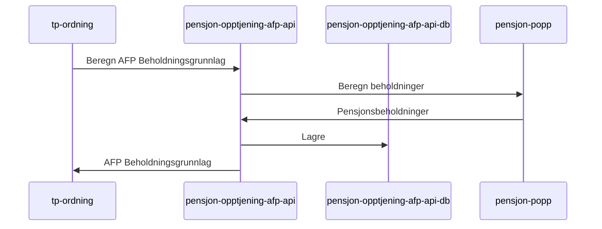
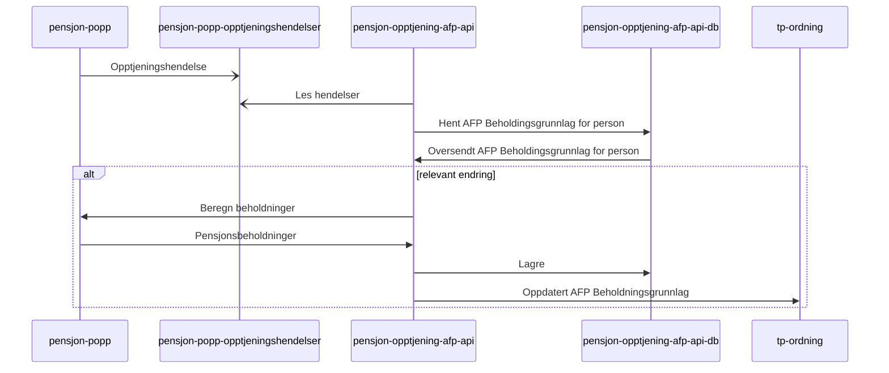

# pensjon-opptjening-afp-api
API for TP leverandører

## Forslag til overordnet flyt ved beregning/simulering

```mermaid
sequenceDiagram
    participant tp as tp-ordning
    participant poaa as pensjon-opptjening-afp-api
    participant pooad as pensjon-opptjening-afp-api-db
    participant popp as pensjon-popp
    
    tp->>poaa: Beregn AFP Beholdningsgrunnlag
    poaa->>popp: Beregn beholdninger
    popp->>poaa: Pensjonsbeholdninger
    poaa->>pooad: Lagre
    poaa->>tp: AFP Beholdningsgrunnlag
```

## Forslag til overordnet flyt ved håndtering av endringer

```mermaid
sequenceDiagram
    participant popp as pensjon-popp
    participant poppoe as pensjon-popp-opptjeningshendelser
    participant poaa as pensjon-opptjening-afp-api
    participant pooad as pensjon-opptjening-afp-api-db
    participant tp as tp-ordning
    
    popp-)poppoe: Opptjeningshendelse
    poaa-)poppoe: Les hendelser
    poaa->>pooad: Hent AFP Beholdingsgrunnlag for person
    pooad->>poaa: Oversendt AFP Beholdingsgrunnlag for person
    alt relevant endring
        poaa->>popp: Beregn beholdninger
        popp->>poaa: Pensjonsbeholdninger
        poaa->>pooad: Lagre
        poaa->>tp: Oppdatert AFP Beholdningsgrunnlag
    end
```
